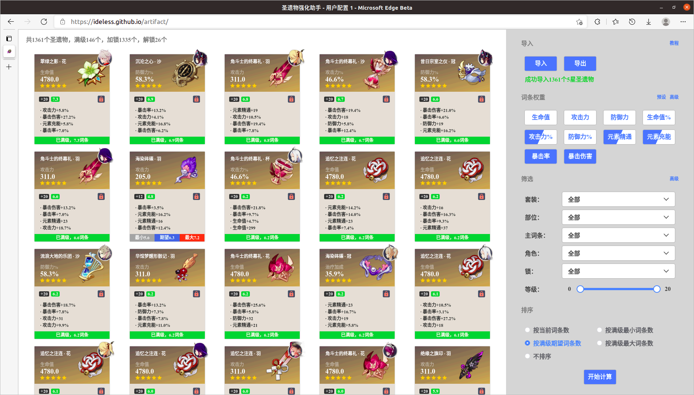

# 0. 教程前的碎碎念

原神在开服近一年半后圣遗物系统依旧很简陋，刚需的圣遗物弃置、词条筛选、套装等功能迟迟不实装，对于经常刷圣遗物到爆仓的玩家很不友好。以我来说，背包超过1500是家常便饭，金圣遗物更是将近1400个，找胚子喂胚子是个噩梦。

正是迫于这一痛点，我制作了这个简单的网页小工具“圣遗物强化助手”。正如其名，这个工具致力于解决我认为十分必要的需求：
1. 基于词条权重、胚子潜力的**排序和筛选**，帮助用户快速定位“极品”胚子；
2. **批量解锁**垃圾圣遗物并应用到游戏背包中，帮助用户快速、安心地清空背包。

圣遗物强化助手本身只是一个网页，获取圣遗物数据、加解锁需要PC端程序完成。需要注意的是，**使用扫描程序接管游戏操作可能有封号风险**，请谨慎决定是否使用，并为自己的行为负责。当然，目前没有还玩家因此封号的案例，我个人使用相当长时间也没有问题。

反馈：[NGA分享贴](https://bbs.nga.cn/read.php?tid=29551863) | [Issue](https://github.com/ideless/artifact/issues) （都是小号，不经常看）

# 1. 下载yas-lock

yas-lock是一个圣遗物扫描、加解锁的Windows端程序。yas-lock是由我对wormtql的 [yas](https://github.com/wormtql/yas) 的代码做少量改动（增加加解锁功能、修复bug等），并在个人电脑上编译的，主要版权归于wormtql，仅供学习交流之用。

[下载地址（约23MB）](https://github.com/ideless/yas-lock/releases/download/v1.0.0/yas-lock.exe) | [项目地址](https://github.com/ideless/yas-lock)

下载后最好放在一个单独的文件夹内，后续产生的数据文件都位于此文件夹内。

# 2. 导出圣遗物

打开游戏，在“设置 / 图像”内将显示模式调整为“1600x900 窗口”：

打开背包的圣遗物界面，并翻到最上面：

右键以管理员身份运行yas-lock：

此时yas-lock应当自动开始扫描背包了，不要操作键鼠，耐心等待一会即可（1500个圣遗物约3分钟）。按鼠标右键可以提前终止扫描。扫描完成后会生成3个文件：mona.json, genmo.json, good.json。它们分别是[莫娜占卜铺](https://www.mona-uranai.com)、[原魔计算器](https://genshin.mingyulab.com/)和[Genshin Optimizor](https://frzyc.github.io/genshin-optimizer/)三个工具的圣遗物数据格式。

# 筛查胚子

打开[圣遗物强化助手](https://ideless.github.io/artifact/)，将yas-lock导出的good.json导入到网站中（圣遗物强化助手可以识别各种格式的圣遗物数据，但只有Genshin optimizor格式的good.json信息最全，其他格式导入后只能筛选胚子，不能加解锁）：

界面右侧灰色部分是**控制面板**，由5个部分组成：
1. **导入**：此处导入数据和导出lock文件（后文会解释）
2. **词条权重**：此处自定义词条权重，分为基本模式和高级模式，基本模式下每个词条的权重分0/0.5/1三档，分别对应按键白底/半白半蓝/蓝底三种状态；高级模式允许以json格式自定义词条权重（如不了解请跳过），词条权重json对象是一组“词条-权重”的键值对，词条和键的对应关系见下表
3. **筛选**：此处自定义筛选条件，分基本和高级模式两种
4. **排序**：此处自定义排序模式，这里“词条数”是指副词条数的总加权和，而副词条以平均值为单位，例如暴击率3.3%算一词条，暴击伤害6.6%算一词条
5. **开始计算**：此处开始计算，因性能原因调整权重、筛选、排序后不会立即生效，需手动点击“开始计算”按键更新界面

界面左侧是**圣遗物面板**，显示筛选、排序后的圣遗物详情：
1. 如果满级，底部显示总词条数
2. 如果未满级，底部灰、蓝、红三块分别显示满级最小、期望、最大词条数
3. 当前等级右侧的绿色方块显示当前词条数
4. 鼠标悬停显示编辑按键，可编辑圣遗物属性

筛查出好胚子就可以到游戏中开赌啦！

附：词条和键的对应关系
| 词条     | 键   |
| -------- | ---- |
| 生命值   | hp   |
| 攻击力   | atk  |
| 防御力   | def  |
| 生命值%  | hpp  |
| 攻击力%  | atkp |
| 防御力%  | defp |
| 元素精通 | em   |
| 元素充能 | er   |
| 暴击率   | cr   |
| 暴击伤害 | cd   |

# 圣遗物加解锁 (Beta)

如前文所述，必须用yas-lock导出的good.json文件才可以使用加解锁功能。此外，用yas-lock导出后暂时**不要动背包**，等从圣遗物强化助手导出lock文件，并应用到背包之后再说，这是因为lock文件记录的是需要修改锁的状态的圣遗物的序号，提前改动背包可能出错。

在圣遗物强化助手的圣遗物界面修改加解锁状态。有两种方式：

1. **逐个加解锁**，操作方式同游戏

2. **批量加解锁**。鼠标悬停在某个圣遗物上时会出现多选框，点击多选框进入多选模式。鼠标左键选中（或取消选中）某圣遗物后，**Shift+鼠标左键**点击另一个圣遗物的多选框以进行区间选中（或取消选中）。

修改完后点击导出，浏览器会开始下载lock文件，文件名为"lock.json"。下载完后，将它放在yas-lock同级文件夹下：

再次打开游戏圣遗物背包界面，并以管理员身份运行yas-lock，此时yas-lock不会自动开始扫描圣遗物，而是询问是否进行加解锁操作，输入y并回车：

很快加解锁就完成啦！